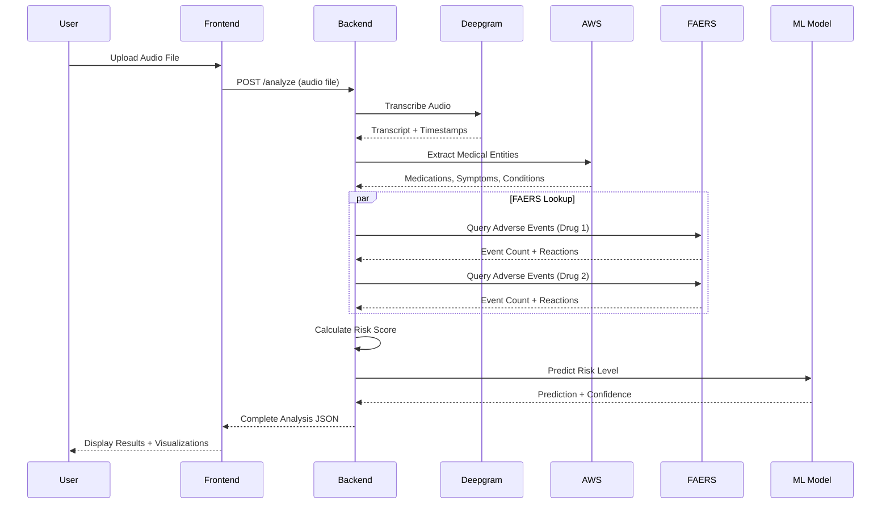
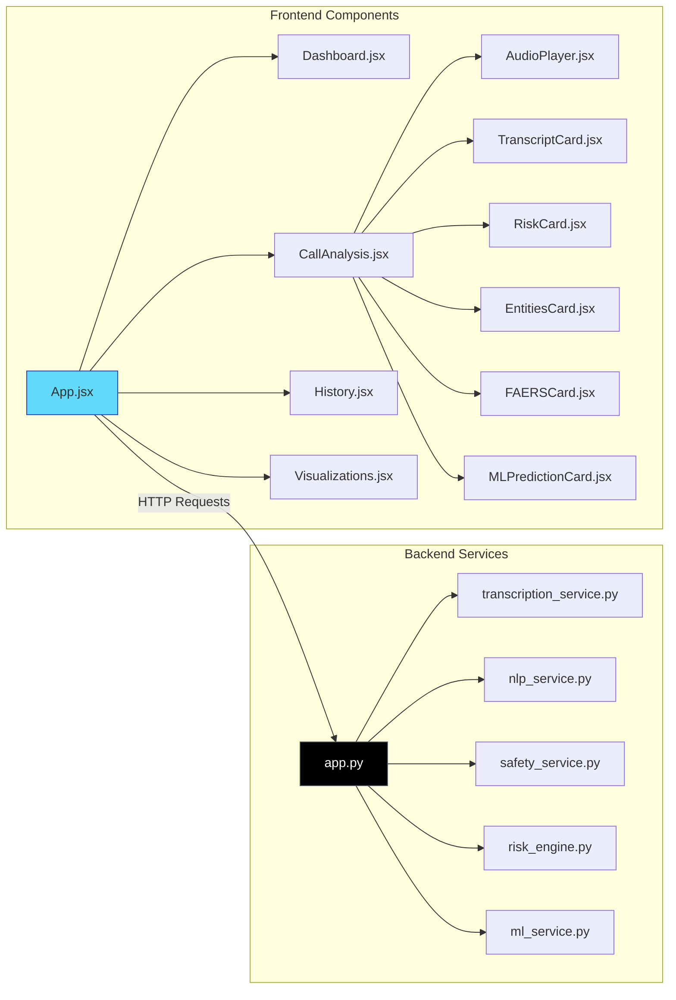
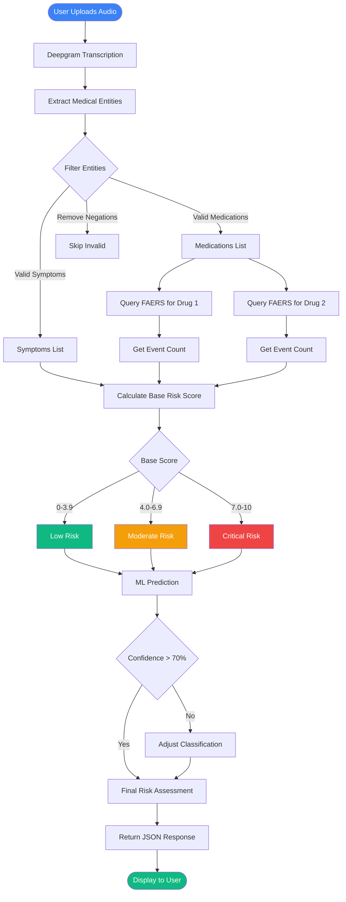
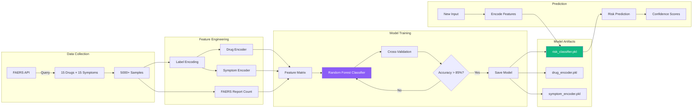
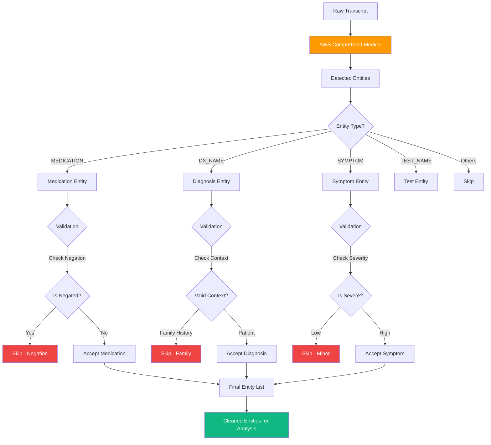
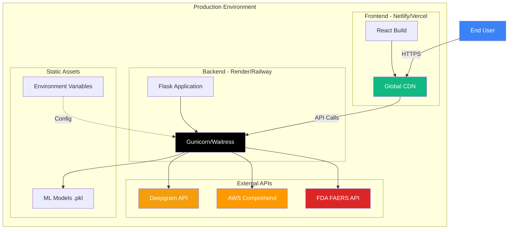
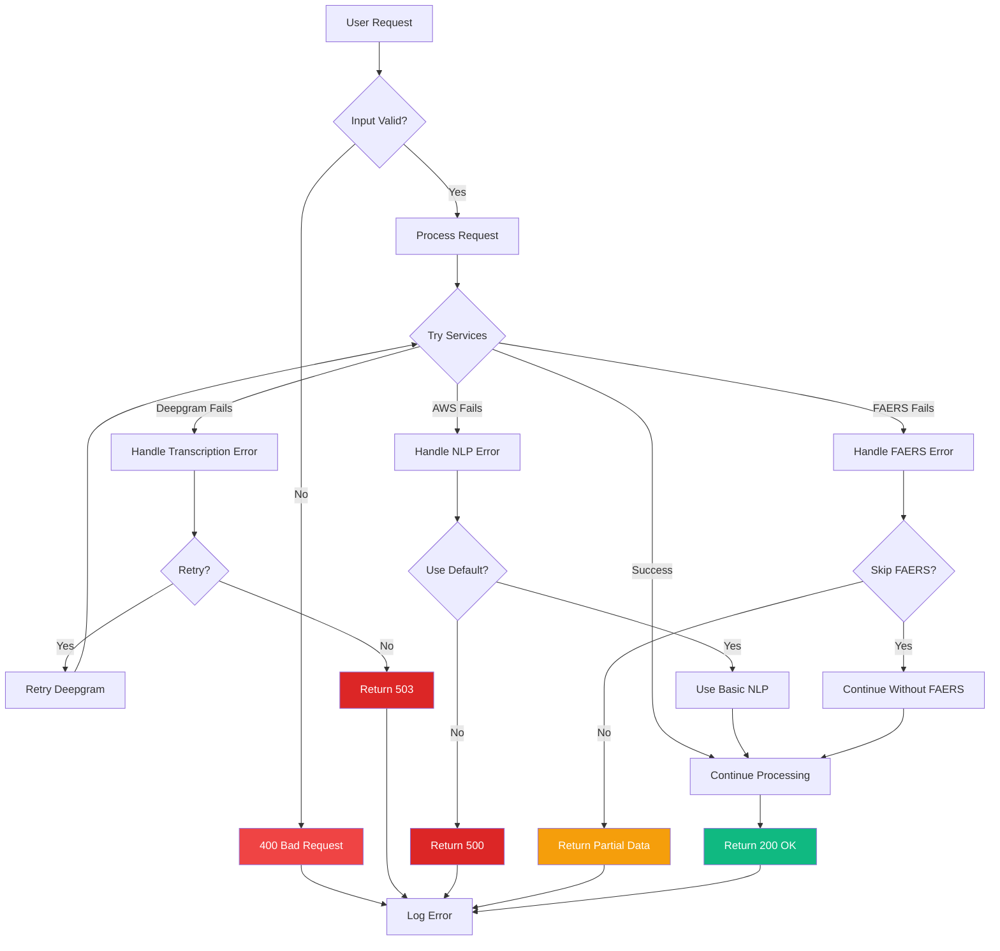

# 🏗️ DeepCare AI - Architecture & Design Flow

## System Architecture Diagram

```mermaid
graph TB
    subgraph Frontend["Frontend Layer"]
        A[React Application]
        A1[Dashboard Component]
        A2[Call Analysis Component]
        A3[History Component]
        A4[Charts Component]
        A --> A1
        A --> A2
        A --> A3
        A --> A4
    end

    subgraph API["API Gateway"]
        B["Flask Backend"]
        B1["Health Endpoint"]
        B2["Analyze Endpoint"]
        B --> B1
        B --> B2
    end

    subgraph Services["Core Services Layer"]
        C[Transcription Service]
        D[NLP Service]
        E[Safety Service]
        C1[Audio Processing]
        D1[Entity Extraction]
        E1[FAERS Lookup]
        C --> C1
        D --> D1
        E --> E1
    end

    subgraph Logic["Business Logic Layer"]
        F[Risk Engine]
        G[ML Service]
        H[Data Pipeline]
        F1[Risk Calculation]
        F2[Severity Classification]
        G1[Random Forest Model]
        G2[Prediction Service]
        H1[Data Processing]
        H2[Feature Engineering]
        F --> F1
        F --> F2
        G --> G1
        G --> G2
        H --> H1
        H --> H2
    end

    subgraph External["External Services"]
        I[Deepgram API]
        J[AWS Comprehend Medical]
        K[FDA FAERS Database]
    end

    subgraph Storage["Data Storage"]
        L[ML Models]
        L1[risk_classifier.pkl]
        L2[drug_encoder.pkl]
        L3[symptom_encoder.pkl]
        L --> L1
        L --> L2
        L --> L3
    end

    A -->|HTTP POST /analyze| B
    B --> C
    B --> D
    B --> E
    C -->|API Call| I
    D -->|API Call| J
    E -->|API Call| K
    B --> F
    B --> G
    B --> H
    F -.-> D
    F -.-> E
    G --> L
    G -.-> F
    F -->|Risk Score| B
    G -->|Prediction| B
    B -->|JSON Response| A

    style A fill:#3B82F6,stroke:#1E40AF,color:#fff
    style B fill:#10B981,stroke:#059669,color:#fff
    style I fill:#F59E0B,stroke:#D97706,color:#fff
    style J fill:#F59E0B,stroke:#D97706,color:#fff
    style K fill:#F59E0B,stroke:#D97706,color:#fff
    style L fill:#8B5CF6,stroke:#7C3AED,color:#fff
```

---

## Data Flow Diagram

---

## Component Architecture

---

## Risk Assessment Flow

---

## ML Model Pipeline

---

## Entity Extraction Process

---

## Deployment Architecture

---

## Technology Stack Layers

```mermaid
graph TD
    subgraph "Presentation Layer"
        A1[React 18.2]
        A2[Tailwind CSS]
        A3[Framer Motion]
        A4[Chart.js]
    end

    subgraph "Application Layer"
        B1[Flask 3.0]
        B2[Python 3.13]
        B3[RESTful API]
    end

    subgraph "Service Layer"
        C1[Deepgram SDK]
        C2[Boto3 AWS]
        C3[Requests HTTP]
    end

    subgraph "Machine Learning"
        D1[scikit-learn]
        D2[pandas]
        D3[numpy]
    end

    subgraph "External APIs"
        E1[Deepgram Nova-2]
        E2[AWS Comprehend Medical]
        E3[openFDA FAERS]
    end

    A1 --> B1
    B1 --> C1
    B1 --> C2
    B1 --> C3
    B1 --> D1
    C1 --> E1
    C2 --> E2
    C3 --> E3

    style A1 fill:#61DAFB
    style B1 fill:#000000,color:#fff
    style E1 fill:#F59E0B
    style E2 fill:#FF9900
    style E3 fill:#DC2626
```

---

## Error Handling Flow

